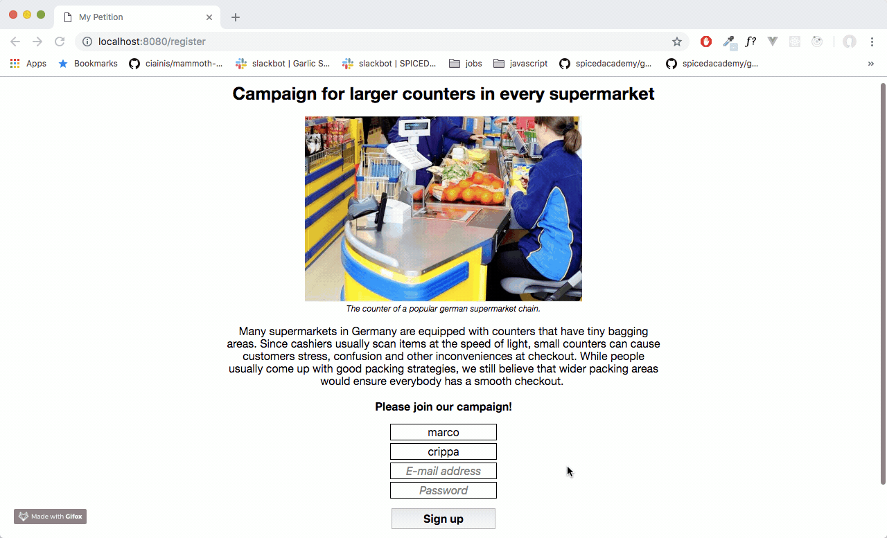
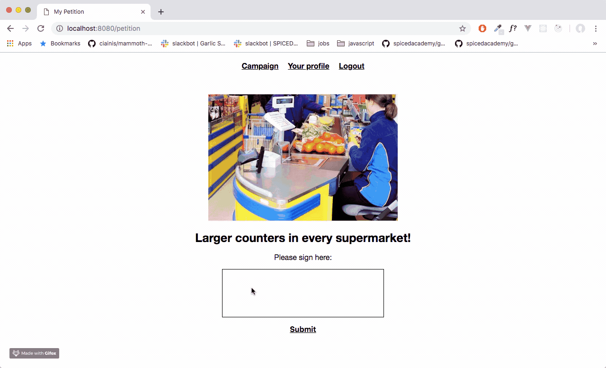

# Petition

I have built an online petition using Javascript, Node.js, Express and PostgreSQL. The aim is to have larger counters in every german supermarket.

## Registration

Users must register and can provide additional information about themselves such as their age, their city and their website.

## Signature

After registering (or logging in if already registered), users can sing (only once) the petition. After signing, users are thanked and a random 'thank you' GIF from GIPHY is rendered on the screen.

## Additional features

Additional features are the possibility to check who already signed the petition (in general or according to the city), add or update a personal profile or delete the signature.
